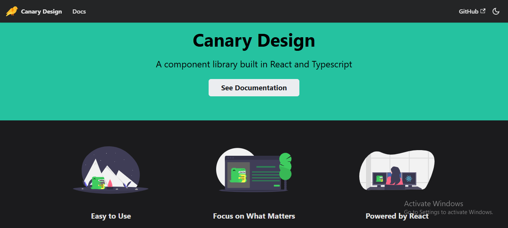

<!-- # React + TypeScript + Vite

This template provides a minimal setup to get React working in Vite with HMR and some ESLint rules.

Currently, two official plugins are available:

- [@vitejs/plugin-react](https://github.com/vitejs/vite-plugin-react/blob/main/packages/plugin-react/README.md) uses [Babel](https://babeljs.io/) for Fast Refresh
- [@vitejs/plugin-react-swc](https://github.com/vitejs/vite-plugin-react-swc) uses [SWC](https://swc.rs/) for Fast Refresh

## Expanding the ESLint configuration

If you are developing a production application, we recommend updating the configuration to enable type aware lint rules:

- Configure the top-level `parserOptions` property like this:

```js
   parserOptions: {
    ecmaVersion: 'latest',
    sourceType: 'module',
    project: ['./tsconfig.json', './tsconfig.node.json'],
    tsconfigRootDir: __dirname,
   },
```

- Replace `plugin:@typescript-eslint/recommended` to `plugin:@typescript-eslint/recommended-type-checked` or `plugin:@typescript-eslint/strict-type-checked`
- Optionally add `plugin:@typescript-eslint/stylistic-type-checked`
- Install [eslint-plugin-react](https://github.com/jsx-eslint/eslint-plugin-react) and add `plugin:react/recommended` & `plugin:react/jsx-runtime` to the `extends` list -->

<kbd></kbd>

# Canary Design

Canary design is a component library built in React + Vite + TypeScript using Vite's library mode. To find out about all the available components and how to use them, read the [Documentation](https://canary-design.netlify.app/).

## ✨ Components

- **Button**
- **Carousel - TypeA**
- **Carousel - TypeB**
- **Drawer**
- **File Upload**
- **Steps**
- **Tabs - TypeA**
- **Tabs - TypeB**
- **Timeline**
- **Tour**

## 🎉 Contributing

Contributions, bug reports, and feature requests are welcome! Please feel free to open an issue or submit a pull request on this repository.

<br>

Made with ❤️ by Vikrant Arora in Kashipur, Uttarakhand ( India )

<!-- # 🌟 Canary Design

**Canary Design** is a modern, scalable, and feature-rich React component library built with **Vite** and **TypeScript**. It empowers developers to create stunning, user-friendly interfaces effortlessly. Designed with flexibility and performance in mind, Canary Design offers a wide range of customizable components for your next React project.

Visit the [**Documentation**](https://canary-design.netlify.app/) to explore all available components and integration guides.

---

## 🚀 Features

- **Modern UI Components**: A growing collection of reusable, customizable, and responsive components.
- **Built for Developers**: Fully typed with TypeScript for an improved developer experience.
- **Lightning Fast**: Built using Vite’s library mode for blazing-fast builds.
- **Easy Integration**: Plug-and-play components designed for React apps.
- **Theming Support**: Style components with custom themes effortlessly.

---

## ✨ Components

| **Component**        | **Description**                                              |
| -------------------- | ------------------------------------------------------------ |
| **Button**           | Fully customizable buttons with multiple variants and sizes. |
| **Carousel - TypeA** | Responsive carousel with autoplay and navigation controls.   |
| **Carousel - TypeB** | Minimalist carousel for a sleek look.                        |
| **Drawer**           | Slide-in navigation or side panels.                          |
| **File Upload**      | Drag-and-drop or browse file upload functionality.           |
| **Steps**            | Stepper for guiding users through workflows.                 |
| **Tabs - TypeA**     | Classic tabbed navigation.                                   |
| **Tabs - TypeB**     | Modern tabbed navigation with animations.                    |
| **Timeline**         | Display events or milestones in a timeline format.           |
| **Tour**             | Guided user interface tours for enhanced onboarding.         |

---

## 📦 Installation

To start using **Canary Design**, add it to your project with:

```bash
npm install canary-design
```

## 🚀 Getting Started

Here’s a quick example to get started with **Canary Design**:

```tsx
import React from "react";
import { Button } from "canary-design";

const App = () => (
  <div>
    <h1>Welcome to Canary Design</h1>
    <Button variant="primary" size="large">
      Click Me
    </Button>
  </div>
);

export default App;
```

Check out the [Documentation](https://canary-design.netlify.app/) for detailed examples and usage instructions.

## 🛠️ Development Setup

If you want to contribute to Canary Design, follow these steps to set up your development environment:

1. Clone the repository:

   ```bash
   git clone https://github.com/your-username/canary-design.git
   ```

2. Navigate to the project directory:

   ```bash
   cd canary-design
   ```

3. Install dependencies:

   ```bash
   npm install
   ```

4. Start the development server:

   ```bash
   npm run dev
   ```

## 🌍 Browser Support

Canary Design supports the latest versions of major browsers, including:

- Chrome
- Firefox
- Safari
- Edge

## 🎉 Contributing

We welcome contributions! Whether it’s fixing bugs, adding new features, or improving documentation, your help is valuable. Please refer to our [Contribution Guidelines](CONTRIBUTING.md) for more details. -->
